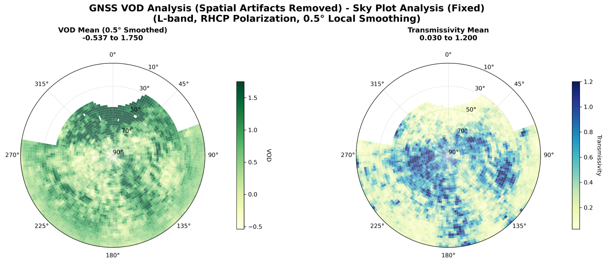

# GNSS Satellite Data Processing

Python scripts for processing GNSS satellite data to find matched observations between forest and open-sky observations. These scripts process TEQC compact format files and perform exact time-matching of elevation, azimuth, and SNR measurements from both recievers for comparative analysis.

## Scientific Background & Data Source

These scripts implement the methodology from **Humphrey & Frankenberg (2023), Biogeosciences**: *"Continuous ground monitoring of vegetation optical depth and water content with GPS signals"*

### GNSS-Based VOD Method
The approach uses **dual GNSS receiver setup**:


*Figure 1: GNSS-based vegetation monitoring setup showing dual receiver configuration for measuring canopy transmissivity*

- **Reference receiver**: Open-sky location (roof-mounted)
- **Forest receiver**: Under vegetation canopy
- **SNR difference (ΔSNR)**: Reflects canopy transmissivity
- **VOD calculation**: VOD = -ln(γ) × cos(θ) where γ = transmissivity, θ = incidence angle

### Processing Methodology


*Figure 2: Complete processing workflow from raw GNSS data to hourly VOD estimates*

The methodology follows a 7-step process:
1. **Data Collection**: SNR from both receivers with satellite geometry
2. **Geometry Matching**: Temporal interpolation of azimuth/elevation 
3. **Observation Pairing**: Match forest and open-sky measurements by satellite and geometry
4. **Transmissivity Calculation**: Convert SNR difference to linear transmissivity
5. **VOD Calculation**: Apply Beer-Lambert law with incidence angle correction
6. **Angular Heterogeneity Correction**: Remove spatial sampling artifacts
7. **Temporal Aggregation**: Create hourly VOD time series


*Figure 3: Spatial heterogeneity in canopy transmissivity (a) and VOD (b) showing why angular correction is essential for time series analysis*

### Key Innovation: Heterogeneity Correction
The spatial heterogeneity correction (Step 6) is critical because:
- **GNSS orbits change continuously**, sampling different parts of the canopy each day
- **Canopy structure is heterogeneous** (dense vs. sparse areas)
- **Without correction**: Apparent temporal changes would be caused by sampling different canopy areas
- **With correction**: True temporal changes in vegetation water content are revealed

The correction process:
1. **Calculate local spatial means** for each viewing direction
2. **Remove spatial pattern**: VOD_residual = VOD_raw - VOD_local_mean  
3. **Add global mean**: VOD_corrected = VOD_residual + VOD_global_mean
4. **Result**: Time series reflects actual vegetation changes, not sampling artifacts

### Key Capabilities
- **Hourly to sub-hourly VOD monitoring** using L-band GNSS signals (1-2 GHz)
- **Diurnal cycle detection** of vegetation water content changes
- **Multi-constellation support** (GPS, GLONASS, Galileo, BeiDou)
- **Canopy water content retrieval** using transmissivity models
- **Rainfall/dew interception monitoring**

## Data Source

The data processed by these scripts is publicly available at:
**https://doi.org/10.6084/m9.figshare.22140575** (Humphrey and Frankenberg, 2023)

This archive contains raw and processed continuous GNSS measurements from the study published in Biogeosciences: https://doi.org/10.5194/bg-20-1789-2023

**Dataset Description:**
- Two Septentrio PolaRx5e receivers
- 8 months of measurements at 15 second intervals  
- GPS, Galileo, GLONASS and BeiDou satellites
- All available frequencies

**Data Structure:**
```
- POLAR1_Roof (clear-sky site)
  -- processed/
     --- azi/ (azimuth information)
     --- ele/ (elevation information) 
     --- sn1/ (carrier-to-noise power density)

- POLAR2_Forest (subcanopy site)
  -- processed/
     --- azi/ (azimuth information)
     --- ele/ (elevation information)
     --- sn1/ (carrier-to-noise power density)
```

Raw data was processed using TEQC software (2019-02-25 final release) to generate the `.azi`, `.ele`, and `.sn1` files used by these scripts.

## Processing Workflow

The complete analysis implements the GNSS-based VOD methodology from **Humphrey & Frankenberg (2023)** and involves four steps:
1. **Process forest data** using `forest_gnss_processor.py`
2. **Process open-sky data** using `opensky_gnss_processor.py`  
3. **Match observations** between environments using `enhanced_gnss_matcher.py`
4. **Calculate VOD** (Vegetation Optical Depth) using `enhanced_vod_analyzer.py`

## Scripts

### 1. Forest Environment Processor (`forest_gnss_processor.py`)

Processes GNSS data from forest environment (POLAR2_Forest dataset).

**File Format**: `SEPT256k.20.sn1` where:
- `256` = day of year  
- `k` = hour code (a=0, b=1, c=2, ..., x=23)
- `sn1`/`ele`/`azi` = data type

**Features**:
- Processes hourly files and corrects timestamps by adding hour offset
- Filters GNSS satellites only (GPS, GLONASS, Galileo, BeiDou - excludes SBAS)
- Exact time matching between SNR, elevation, and azimuth data
- Parallel or sequential processing

### 2. Open-Sky Processor (`opensky_gnss_processor.py`)

Processes GNSS data from open-sky environment (POLAR1_Roof dataset).

**File Format**: `SEPT2560.20.sn1` where:
- `256` = day of year
- `0` = identifier  
- `sn1`/`ele`/`azi` = data type

**Features**:
- Processes daily files with direct timestamps
- Includes ALL satellites (GPS, GLONASS, Galileo, BeiDou, SBAS)
- Exact time matching between SNR, elevation, and azimuth data  
- Parallel or sequential processing

### 3. Enhanced GNSS Matcher (`enhanced_gnss_matcher.py`)

Matches observations between forest and open-sky environments from the processed data.

**Input**: Pickle files generated by the forest and open-sky processors

**Features**:
- **Time-based matching**: Configurable time window tolerance (default: 1 second)
- **Geometry matching**: Optional azimuth/elevation angle matching with tolerance
- **Complete timestamp preservation**: Maintains all timing information from both datasets
- **SNR comparison**: Calculates delta SNR (forest - open-sky) for signal analysis
- **Flexible data loading**: Handles different pickle file structures automatically
- **Comprehensive output**: Preserves day-of-year, hour, minute, second, and seconds_of_day from both environments

**Matching Process**:
1. Loads processed forest and open-sky data from pickle files
2. Finds common satellites between both datasets
3. For each satellite, matches observations based on:
   - Time difference within specified window
   - Azimuth/elevation similarity (if geometry data available)
4. Selects closest temporal match when multiple candidates exist
5. Outputs paired observations with complete timestamp details

### 4. Enhanced VOD Analyzer (`hourly_vod.py`)

Calculates Vegetation Optical Depth (VOD) from matched forest/open-sky observations using the methodology from Humphrey & Frankenberg (2023).

**Input**: CSV file generated by the enhanced GNSS matcher

**Scientific Implementation**:
- **Transmissivity calculation**: T = 10^(ΔS/10) where ΔS is delta SNR between forest and open-sky
- **VOD calculation**: VOD = -ln(T) × cos(θ) where θ is incidence angle (90° - elevation)
- **Canopy water content (CWC)**: Derived using vegetation dielectric models
- **Spatial averaging**: BallTree algorithm for neighbor-based processing following the paper's methodology

**Features**:
- **Flexible data loading**: Automatically detects and loads matched data CSV files
- **Multiple filtering steps**: Elevation filter, spatial domain filter, transmissivity thresholds
- **Artifact removal**: Removes NE/NW artifacts from specific azimuth/elevation ranges
- **Hourly aggregation**: Creates hourly VOD time series for temporal analysis
- **Diurnal cycle analysis**: Captures sub-daily variations in vegetation water content

**Filtering Applied (based on Humphrey & Frankenberg 2023)**:
- Elevation ≥ 10° (configurable)
- NE artifacts: 0°-70° azimuth, ≤30° elevation (building)
- NW artifacts: 280°-340° azimuth, ≤40° elevation (building)

## Requirements

```
pandas
numpy  
matplotlib
pathlib
tqdm
concurrent.futures
logging
datetime
seaborn
scipy
numba
scikit-learn
glob
```

## Usage

### Complete Workflow

#### Step 1: Process Forest Data
```python
from forest_gnss_processor import main_forest_exact_match_processing

forest_data = main_forest_exact_match_processing(
    base_path='unzip/gnss_data_archive/POLAR2_Forest/processed',
    use_parallel=True,
    max_workers=4
)
```

#### Step 2: Process Open-Sky Data
```python
from opensky_gnss_processor import main_opensky_exact_match_processing

opensky_data = main_opensky_exact_match_processing(
    base_path='unzip/gnss_data_archive/POLAR1_Roof/processed', 
    use_parallel=True,
    max_workers=4
)
```

#### Step 3: Match Observations Between Environments
```python
from enhanced_gnss_matcher import EnhancedGNSSMatcher

# Create matcher with parameters
matcher = EnhancedGNSSMatcher(
    time_window_seconds=5,
    angle_tolerance_degrees=5,
    min_elevation=10.0,
    max_elevation=90.0
)

# Run matching (loads pickle files automatically)
matched_results = matcher.run_matching()
```

#### Step 4: Calculate VOD (Vegetation Optical Depth)
```python
from enhanced_vod_analyzer import EnhancedVODAnalyzer

# Create analyzer with parameters
analyzer = EnhancedVODAnalyzer(
    min_elevation=10.0,
    neighbor_radius=0.5
)

# Run complete VOD analysis (loads matched CSV automatically)
vod_results = analyzer.run_complete_analysis()
```

## Functions

### Common Functions
- `read_teqc_compact3_file_working()` - Reads TEQC files and extracts data
- `create_datetime_from_components()` - Creates datetime from day and seconds
- `match_satellite_data_exact_time()` - Matches data at exact timestamps
- `process_single_day_data_exact_match()` - Processes one day of data
- `process_all_days_parallel_exact_match()` - Parallel processing of all days
- `process_all_days_sequential_exact_match()` - Sequential processing of all days

### Forest-Specific Functions
- `parse_forest_filename()` - Parses forest filename format
- `get_hour_number_from_code()` - Converts hour code to number
- `filter_gnss_no_sbas()` - Filters GNSS satellites excluding SBAS
- `load_forest_day_data_for_exact_match()` - Loads and corrects forest data
- `match_forest_satellite_data_exact_time()` - Forest-specific time matching

### Open-Sky-Specific Functions  
- `parse_filename_official_format()` - Parses open-sky filename format
- `filter_all_satellites_including_sbas()` - Includes all satellites with SBAS
- `get_available_days_and_files()` - Scans for available data files

### Enhanced GNSS Matcher Functions
- `EnhancedGNSSMatcher` - Main class for matching observations
- `load_data()` - Loads forest and roof data from pickle files
- `prepare_data()` - Cleans and prepares data with datetime handling
- `match_observations()` - Matches forest and roof observations
- `_find_matches_for_satellite_enhanced()` - Finds matches for individual satellites
- `_add_snr_data()` - Adds SNR data and calculates delta SNR
- `_standardize_datetime_columns()` - Handles different datetime formats
- `_add_datetime_components()` - Adds comprehensive datetime components
- `run_matching()` - Executes complete matching process

### Enhanced VOD Analyzer Functions
- `EnhancedVODAnalyzer` - Main class for VOD calculation and analysis
- `load_matched_data()` - Loads matched GNSS data from CSV files
- `validate_input_data()` - Validates required columns and data structure
- `apply_elevation_filter()` - Applies elevation threshold filtering
- `apply_spatial_domain_filter()` - Applies spatial filtering and artifact removal
- `calculate_delta_snr_and_transmissivity()` - Calculates transmissivity from delta SNR
- `calculate_spatial_averages_optimized()` - Optimized spatial averaging using BallTree
- `create_hourly_vod_timeseries()` - Creates hourly aggregated VOD time series
- `run_complete_analysis()` - Executes complete VOD analysis pipeline

## Output

### Individual Processor Output

#### Data Columns (Forest & Open-Sky Processors)
- `day_of_year` - Day of year (1-365)
- `satellite_id` - Satellite identifier  
- `datetime` - Full timestamp
- `seconds_of_day` or `corrected_seconds` - Time in seconds
- `hour`, `minute`, `second` - Time components
- `azimuth` - Satellite azimuth angle (degrees)
- `elevation` - Satellite elevation angle (degrees)
- `snr` - Signal-to-noise ratio (dB)

#### Output Files (Forest & Open-Sky Processors)
- `.pkl` - Pickle file with data and metadata
- `.csv` - CSV format
- `.parquet` - Parquet format  
- `_metadata.txt` - Processing statistics

### Enhanced Matcher Output

#### Matched Data Columns
- `satellite_id` - Common satellite identifier
- `forest_idx`, `roof_idx` - Original data indices
- `time_diff_seconds` - Time difference between observations
- **Forest timestamp data**: `forest_datetime`, `forest_day_of_year`, `forest_hour`, `forest_minute`, `forest_second`, `forest_seconds_of_day`
- **Roof timestamp data**: `roof_datetime`, `roof_day_of_year`, `roof_hour`, `roof_minute`, `roof_second`, `roof_seconds_of_day` 
- **Geometry data** (if available): `forest_elevation`, `forest_azimuth`, `roof_elevation`, `roof_azimuth`, `elevation_diff`, `azimuth_diff`
- **SNR data** (if available): `forest_snr`, `roof_snr`, `delta_snr`

#### Matcher Output Files
- `gnss_matches_enhanced_YYYYMMDD_HHMMSS.csv` - Matched observations with complete timestamp information

### Enhanced VOD Analyzer Output

#### Individual Observations Data Columns
- All matched data columns from matcher output plus:
- `transmissivity` - Calculated from delta SNR using T = 10^(ΔS/10)
- `incidence_angle` - 90° - elevation
- `vod_raw` - Raw VOD calculation: -ln(T) × cos(θ)
- `vod_anomaly` - VOD anomaly: individual - local mean + global mean
- `vod_processed` - Final processed VOD values
- `transmissivity_local_mean` - Spatially averaged transmissivity
- `vod_raw_local_mean` - Spatially averaged raw VOD
- `neighbor_count` - Number of spatial neighbors used for averaging

#### Hourly Aggregated Data Columns
- `hour_bin` - Hourly timestamp (YYYY-MM-DD HH:00:00)
- `vod_processed_mean` - Mean VOD per hour
- `vod_processed_std` - Standard deviation of VOD per hour
- `vod_processed_count` - Number of observations per hour
- `transmissivity_mean` - Mean transmissivity per hour
- `delta_snr_mean` - Mean delta SNR per hour
- `forest_elevation_mean` - Mean elevation per hour
- `satellite_id_nunique` - Number of unique satellites per hour
- `year`, `month`, `day`, `hour`, `doy` - Time components

#### VOD Analyzer Output Files
- `vod_individual_observations_YYYYMMDD_HHMMSS.csv` - Individual VOD calculations
- `vod_hourly_timeseries_YYYYMMDD_HHMMSS.csv` - Hourly aggregated VOD data

### Plots Generated (Forest & Open-Sky Processors)
- Satellite coverage by day heatmap
- Daily exact match counts timeline
- SNR distribution by satellite boxplots

## Logging

All four scripts use Python logging module with:
- INFO level logging with detailed progress information
- Progress tracking with tqdm progress bars
- Error handling and reporting
- Processing time measurement
- Statistical summaries and validation checks
